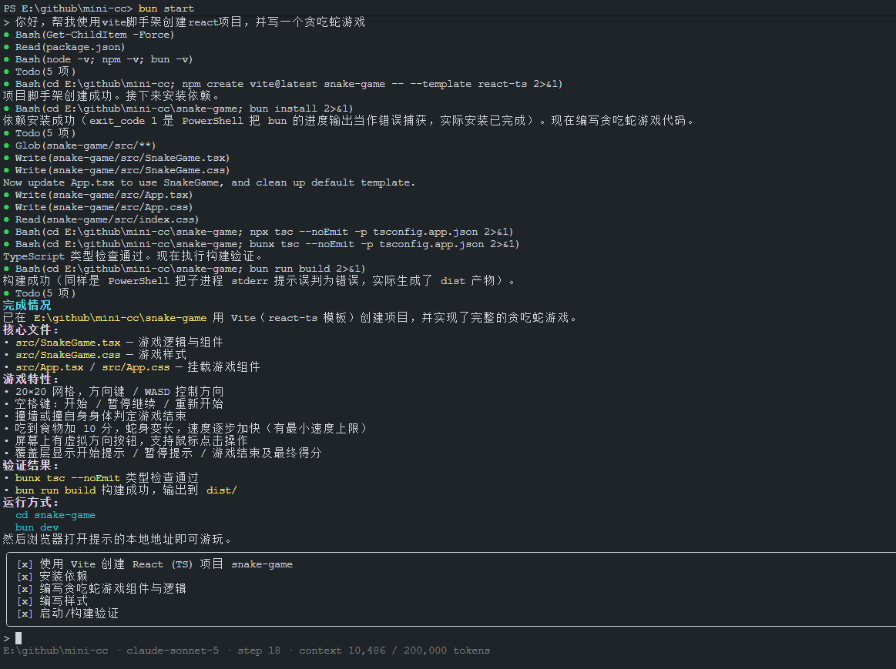
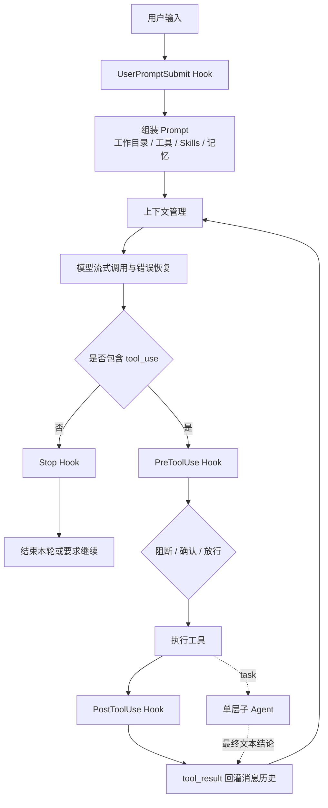
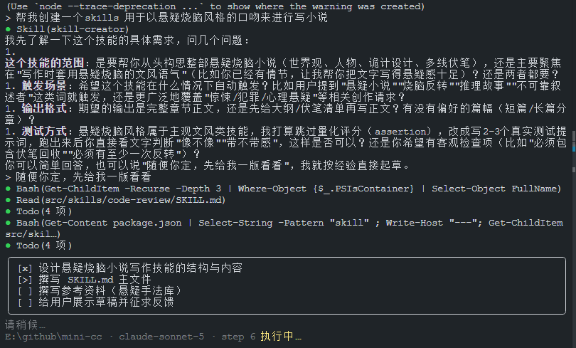

# mini CC Agent

一个使用 TypeScript、Bun、Ink 和 Anthropic SDK 实现的终端编码 Agent。项目重点不是替代成熟的 Coding Agent 产品，而是用尽量小、可读、可测试的代码，跑通 Agent Loop、工具调用、权限控制、任务规划、子 Agent、Skills、上下文压缩、错误恢复和流式 TUI 等核心机制。

> 项目定位：用于学习、机制验证和个人开发实践。当前权限模型不是安全沙箱，请勿在生产环境或包含高价值凭据的目录中运行不可信任务。



上图展示了 Agent 创建 Vite + React 项目、读写文件、维护 Todo、执行类型检查并完成构建验证的过程。

## 功能状态

| 能力           | 状态             | 当前实现                                                              |
| -------------- | ---------------- | --------------------------------------------------------------------- |
| Agent Loop     | 已实现           | 基于 Anthropic `tool_use` / `tool_result` 的循环执行，单轮最多 90 步  |
| 文件与命令工具 | 已实现           | `bash`、`read_file`、`write_file`、`edit_file`、`glob`                |
| 任务规划       | 已实现           | 使用 `todo_write` 保存并在 TUI 中展示任务状态                         |
| 子 Agent       | 已实现，范围有限 | 单层、串行执行，使用独立消息状态，只向父 Agent 返回最终文本结论       |
| Skills         | 已实现           | 启动时扫描 Skill 元数据，通过 `load_skill` 按需加载完整说明           |
| 上下文压缩     | 已实现           | 大结果落盘、中段裁剪、旧工具结果压缩、LLM 摘要和超限后的反应式压缩    |
| 记忆           | 部分实现         | 读取工作区 `.memory/MEMORY.md` 并注入提示词；不会自动抽取、检索或更新 |
| 权限与 Hook    | 已实现，非沙箱   | Bash 命令阻断/确认、文件路径约束、工作目录注入和调用审计              |
| 错误恢复       | 已实现           | 429/529/连接错误重试、备用模型降级、截断续写、上下文超限恢复          |
| 流式 TUI       | 已实现           | Ink + React、流式 Markdown、工具状态、Todo、权限确认和上下文用量      |
| Langfuse 可观测性 | 已实现         | 可选接入 Cloud，记录 Agent、模型、工具、子 Agent、错误、Token 和延迟  |
| 回归评测       | 已实现           | Cloud Dataset、确定性断言、Anthropic Judge、每项顺序运行 3 次         |
| 原生上网       | 未实现           | 没有 Web Search、网页抓取、浏览器或引用管理工具                       |

## 核心流程



核心循环位于 `src/core/loop.ts`。模型负责决定下一步，Harness 负责准备上下文、暴露工具、控制权限、执行动作并把结果送回模型。

## 快速开始

### 环境要求

- Bun：依赖安装、开发运行、测试和构建
- Node.js 20+：运行编译后的 ESM CLI 和 Langfuse v5
- Anthropic API 或兼容 Anthropic Messages API 的服务
- 支持 TTY 的交互式终端

### 安装依赖

```bash
bun install
```

### 配置模型

在项目根目录创建 `.env`：

```dotenv
API_KEY=your_api_key
MODEL_ID=your_model_id

# 可选：Anthropic Messages API 兼容服务地址
# BASE_URL=https://your-api-endpoint.example.com

# 可选：主模型连续出现 3 次 529 后切换
# FALLBACK_MODEL_ID=your_fallback_model_id
```

建议明确设置 `MODEL_ID`，并以实际 API 服务支持的模型名称为准。

### 配置 Langfuse Cloud（可选）

不配置 Langfuse 时，现有 TUI 和 Agent 行为不变。需要上传 Trace 或运行回归评测时，在 `.env` 中增加：

```dotenv
LANGFUSE_PUBLIC_KEY=pk-lf-...
LANGFUSE_SECRET_KEY=sk-lf-...
LANGFUSE_BASE_URL=https://cloud.langfuse.com
LANGFUSE_DATASET_NAME=mini-cc-core-eval
EVAL_WORKSPACE_ROOT=E:\\mini-cc-eval
```

`LANGFUSE_BASE_URL` 默认使用 EU Cloud。使用 US、JP、HIPAA 或自托管实例时，应改为对应实例地址。

> 数据风险：启用后，完整 System Prompt、消息上下文、工具参数、工具结果、Agent 输出以及其中包含的源码内容会发送到 Langfuse。当前实现不脱敏、不截断；不要在含有不应上传的密钥、个人信息或受限源码的目录中启用。

### 启动

在当前目录运行：

```bash
bun run dev
```

指定 Agent 操作的工作目录：

```bash
bun run dev -- --cwd E:\path\to\your-project
```

构建后运行：

```bash
bun run build
bun run start -- --cwd E:\path\to\your-project
```

CLI 只支持交互式 TTY。通过管道、CI 或无终端环境启动时会直接退出。

## 已实现功能

### 1. Agent Loop 与工具系统

每一步会先管理上下文和组装 Prompt，再流式调用模型。模型返回工具调用时，Agent 依次执行工具并把成功结果、权限拒绝或异常统一作为 `tool_result` 回灌，让模型自行修正后继续。

| 工具         | 作用                 | 主要边界                                                                     |
| ------------ | -------------------- | ---------------------------------------------------------------------------- |
| `bash`       | 执行系统命令         | Windows 使用 PowerShell，其他平台使用 `/bin/sh`；默认 120 秒超时并终止进程树 |
| `read_file`  | 读取 UTF-8 文本文件  | 路径必须位于当前工作目录内                                                   |
| `write_file` | 写入完整文件内容     | 路径必须位于当前工作目录内                                                   |
| `edit_file`  | 精确替换文本         | 只替换第一处完全匹配的 `old_text`                                            |
| `glob`       | 按 Glob 模式查找文件 | 只返回文件，不感知 `.gitignore`                                              |
| `todo_write` | 创建或更新任务计划   | 状态为 `pending`、`in_progress`、`completed`                                 |
| `task`       | 执行隔离子任务       | 仅顶层 Agent 可用，单层串行执行                                              |
| `load_skill` | 加载完整 Skill 指令  | 只能加载启动时已扫描到的 Skill                                               |

### 2. 上下文压缩

上下文管理在每次模型请求前执行，按成本从低到高逐层处理：

| 层级         | 默认触发条件                          | 处理方式                                                                                   |
| ------------ | ------------------------------------- | ------------------------------------------------------------------------------------------ |
| 工具结果落盘 | 最新一批工具结果总量超过 200,000 字符 | 将较大的结果写入 `.minicc/task_outputs/tool-results/`，上下文保留 2,000 字符预览和文件路径 |
| 消息中段裁剪 | 消息超过 50 条                        | 保留头部 3 条和最近消息，中段替换为裁剪标记                                                |
| 微压缩       | 上下文超过 90,000 token               | 保留最近 25 条工具结果，较早结果替换为包含工具名和参数的占位信息                           |
| LLM 全量摘要 | 上下文超过 150,000 token              | 先写入 `.minicc/transcripts/*.jsonl`，再用模型摘要替换历史                                 |
| 反应式压缩   | API 返回 `prompt too long`            | 保留最近 5 条消息，摘要更早历史后重试；单轮最多触发一次                                    |

裁剪时会尽量保持 `tool_use` 和 `tool_result` 成对，避免形成 Anthropic API 无法接受的消息序列。Token 数优先使用 API 返回的真实 `input_tokens`，首次请求前才使用字符数估算。

### 3. Skills 按需加载

CLI 默认扫描随项目或构建产物发布的 `skills/<name>/SKILL.md`：

1. 启动时只把 Skill 的 `name` 和 `description` 放入 System Prompt。
2. 模型判断当前任务需要某项 Skill 时，调用 `load_skill`。
3. 完整 `SKILL.md` 内容只在实际使用时进入上下文。

这种方式避免把所有 Skill 全文永久塞进 Prompt。新增内置 Skill 时，可在 `src/skills/<skill-name>/SKILL.md` 中提供带 `name`、`description` 的 frontmatter，并重新构建项目。



### 4. 工作区记忆

每个工作目录都可以提供一个可选文件：

```text
<workspace>/.memory/MEMORY.md
```

文件内容会作为“相关记忆”加入 System Prompt，适合记录稳定的项目约束，例如包管理器、测试命令、目录约定和提交要求。

当前只实现记忆读侧：Agent 不会自动从对话中抽取记忆，也不会自动写回、按相关性检索、合并冲突或淘汰过期内容。

### 5. Hook、权限与审计

HookBus 提供四个生命周期事件：

- `UserPromptSubmit`：用户输入进入消息历史前
- `PreToolUse`：工具执行前
- `PostToolUse`：工具执行后
- `Stop`：模型不再调用工具、准备结束时

Hook 可以返回 `continue`、`block`、`ask`、`inject` 或 `respawn`。默认 Hook 包含：

- 向用户输入追加当前工作目录
- 对 Bash 命令执行禁止规则、确认规则和默认放行规则
- 将工具名和输入写入 `.minicc/mini-agent-audit.jsonl`
- 使用 `safePath()` 将文件工具限制在当前工作目录内

权限规则只能降低误操作风险，不能替代容器、虚拟机、操作系统权限或独立工作区。特别是 `bash` 仍以当前用户权限运行，并不受文件工具的目录边界限制。

### 6. 错误恢复

| 情况                   | 恢复策略                                                              |
| ---------------------- | --------------------------------------------------------------------- |
| 429、529、API 连接错误 | 指数退避重试，默认最多 10 次；存在 `Retry-After` 时优先遵守服务端时间 |
| 连续 3 次 529          | 配置 `FALLBACK_MODEL_ID` 后自动切换备用模型                           |
| 输出达到 `max_tokens`  | 追加续写指令，最多自动续写 3 次                                       |
| `prompt too long`      | 触发一次反应式上下文压缩后重试                                        |
| 主动摘要连续失败       | 失败累计 3 次后停止继续尝试主动摘要，避免反复消耗                     |

不同模型的输出上限通过模型 ID 映射为 64,000 或 128,000 token，不会在运行中盲目提高到模型不支持的值。

### 7. 单层子 Agent

顶层 Agent 可以通过 `task` 将一个完整子任务交给新的 State：

- 子 Agent 只收到任务描述，不继承父 Agent 的消息历史。
- 父子 Agent 共享工作目录、Skills、Hook 和权限规则。
- 子 Agent 不再拥有 `task` 工具，避免递归委派。
- 父 Agent 只接收子 Agent 的最后一段文本结论，中间消息不进入父上下文。
- 当前工具调用和子任务均为串行执行，没有并行调度。

### 8. 流式终端界面

TUI 基于 Ink + React，支持：

- 主 Agent 文本增量输出
- 标题、段落、代码块、列表、引用、分隔线和表格等 Markdown 块
- 已闭合块静态提交，未闭合尾块以 32ms 周期刷新
- 工具调用状态和子 Agent 缩进展示
- Todo 面板和运行状态栏
- 危险命令的允许/拒绝确认框
- 当前模型、步骤数和上下文 token 用量

### 9. Langfuse 可观测性与回归评测

配置 Langfuse 后，TUI 会按以下层级记录 Trace：

```text
Agent
├── Generation（完整 Prompt、上下文、工具定义、输出、Token、首 Token 和耗时）
├── Tool（参数、结果、错误和耗时）
│   └── 子 Agent
└── 重试、模型降级等 Event
```

运行 Cloud 评测：

```powershell
bun run eval
```

首次运行会创建或同步 `LANGFUSE_DATASET_NAME` 指定的 Dataset。内置评测覆盖创建文件、精准编辑、测试修复、工具失败恢复和多步骤 Todo；每个任务在不同临时目录中顺序运行 3 次，单次失败不会中止后续任务。`EVAL_WORKSPACE_ROOT` 可选，用于指定临时评测工作区的父目录；未配置时使用系统临时目录。每次运行仍会创建唯一子目录，评测结束后自动清理。

每次运行先执行文件、命令、最终输出和 Todo 等确定性断言，再由当前 Anthropic 模型独立评估准确性、相关性、完整性和创造性。Dataset Run 同时记录任务成功率、断言通过率、延迟、Token、工具错误率、重试成功率和稳定性。模型成本由 Langfuse 根据 generation 的模型 ID 与 usage 计算；无法匹配价格的自定义模型可能不显示成本。

一次完整内置评测至少包含 15 次真实 Agent 运行和 15 次 Judge 调用，会产生 Anthropic API 与 Langfuse 用量。运行前请确认配额和费用。

真实 Bad Case 可以在 Langfuse UI 中加入同一 Dataset，Item 需要满足以下结构：

```json
{
  "input": { "prompt": "任务说明", "files": { "path": "初始内容" } },
  "expectedOutput": { "objective": "验收目标" },
  "metadata": {
    "schemaVersion": 1,
    "name": "用例名称",
    "assertions": [{ "type": "file_exists", "path": "result.txt" }]
  }
}
```

`command_succeeds` 断言会在本机临时工作区执行 Dataset 中的命令。只允许可信成员编辑评测 Dataset，不要运行来源不明的 Bad Case。

## 未实现与已知边界

| 能力          | 当前边界                                                                                                                                                            |
| ------------- | ------------------------------------------------------------------------------------------------------------------------------------------------------------------- |
| 原生上网      | 没有 `web_search`、HTTP 抓取、网页正文提取、浏览器自动化或引用管理。可以让 `bash` 调用宿主机已有的 `curl`、`Invoke-WebRequest`、`gh` 等命令，但这不等于内建联网能力 |
| 自动长期记忆  | 没有记忆抽取、写回、相关性检索、冲突合并、过期策略和向量检索                                                                                                        |
| 并行多 Agent  | 没有并行子 Agent、Agent Team、Agent 间通信、嵌套委派或 worktree 隔离                                                                                                |
| 安全沙箱      | 没有容器、虚拟机或系统调用级隔离；正则权限规则可能被复杂命令绕过                                                                                                    |
| 高级代码编辑  | 没有 AST/LSP 语义编辑、补丁冲突处理、模糊匹配或多处批量替换                                                                                                         |
| 会话恢复      | `.minicc/transcripts` 用于压缩前留档和排查，不会在新进程启动时自动恢复历史                                                                                          |
| 任务控制      | 执行过程中没有用户主动取消、暂停、恢复或模型流中断续传                                                                                                              |
| Headless 模式 | 没有通用的非交互式一次性 Agent 命令、管道输入、HTTP 服务或 CI 执行模式；仅提供专用的 `bun run eval` 评测入口                                                        |
| 扩展协议      | 没有 MCP 接入、浏览器工具、图片理解或自动发现用户级/项目级 Skills                                                                                                   |
| 多 Provider   | 当前直接使用 Anthropic SDK 和 Anthropic Messages API 结构，没有 OpenAI、Gemini 等统一 Provider 抽象                                                                 |

## 项目结构

```text
src/
├── cli/         # CLI 入口与工作目录解析
├── context/     # 上下文预算、压缩、结果与 transcript 落盘
├── core/        # Agent Loop、State、模型恢复、事件和运行时工具绑定
├── evaluation/  # Dataset 同步、隔离工作区、断言、Judge、Runner 和评测 CLI
├── hooks/       # HookBus、权限、审计和默认 Hook
├── markdown/    # 增量 Markdown 块与行内语法解析
├── observability/ # Langfuse/OpenTelemetry 适配和空实现
├── prompt/      # System Prompt 分段组装与缓存
├── skills/      # 随包发布的内置 Skills
├── tools/       # Bash、文件、Todo、Skill、子 Agent 工具
└── tui/         # Ink 组件、会话 Hook、显示模型和确认桥接

test/            # 核心循环、上下文、权限、工具、Skills 与 TUI 测试
docs/image/      # README 演示图片
```

## 开发与验证

```bash
bun test
bun run typecheck
bun run build
bun pm pack --dry-run
```

构建过程会编译标准 ESM、重写 TypeScript 路径别名，并将 `src/skills` 复制到 `dist/skills`。发布后的 CLI 入口为 `mini-agent`。
